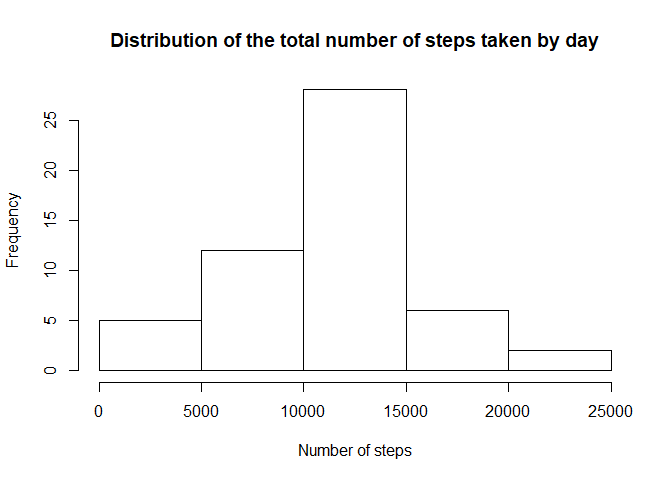
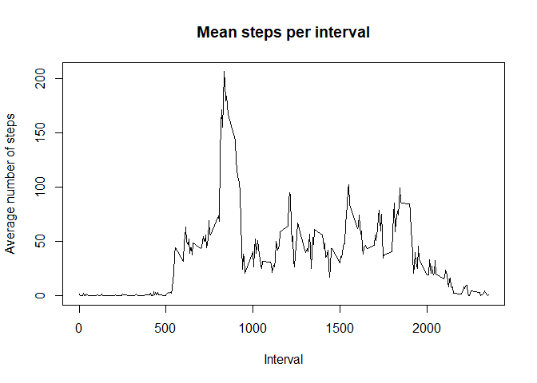
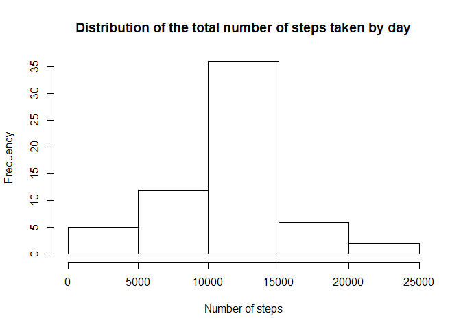
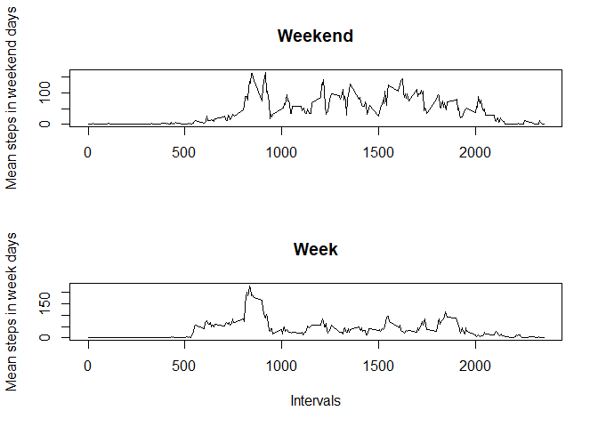

Loading the necessary libraries for the study.


```
## -- Attaching packages ---------------------------------------------------------------------------------------------------------------------------------- tidyverse 1.3.0 --
```

```
## v ggplot2 3.3.0     v purrr   0.3.3
## v tibble  3.0.0     v dplyr   0.8.5
## v tidyr   1.0.2     v stringr 1.4.0
## v readr   1.3.1     v forcats 0.5.0
```

```
## -- Conflicts ------------------------------------------------------------------------------------------------------------------------------------- tidyverse_conflicts() --
## x dplyr::filter() masks stats::filter()
## x dplyr::lag()    masks stats::lag()
```

```
## 
## Attaching package: 'lubridate'
```

```
## The following objects are masked from 'package:dplyr':
## 
##     intersect, setdiff, union
```

```
## The following objects are masked from 'package:base':
## 
##     date, intersect, setdiff, union
```


## Loading and preprocessing the data
The data is read using the read.csv() function after the "activity.csv" file was put into the working directory. The object is called "database".
Dates were originally read as factors, so the function as.Date() is used to convert this variable to the right type.


```r
database <- read.csv("activity.csv", na.strings = "NA")
database$date <- as.Date(database$date)
```


## What is mean total number of steps taken per day?
Since the original database has missing values in the "steps" column, the function complete.cases() is used to filter them.
The new object was called "databaseFiltered".


```r
completecases <- complete.cases(database)
databaseFiltered <- database[completecases, ]
```

The next step is to segment the new data base by the variable "date". For that, the function group_by is used and the new data set is summarized with the creation of the new variable "sumofstepsperday".


```r
bydate <- group_by(databaseFiltered, date)
summarybydate <- summarize(bydate, sumofstepsperday = sum(steps))
```

The new variable is then plotted in a histogram and its mean and median values are calculated.


```r
hist(summarybydate$sumofstepsperday, main = "Distribution of the total number of steps taken by day", xlab = "Number of steps")
```

<!-- -->

```r
meanperday <- mean(summarybydate$sumofstepsperday)
medianperday <- median(summarybydate$sumofstepsperday)
```

The mean number of steps per day is 10766 and the median number of steps per day is 10765.


## What is the average daily activity pattern?
The next step is to segment the data base by interval. For that, the function group_by is used and the new data set is summarized with the creation of the new variable "meansteps".


```r
byinterval <- group_by(databaseFiltered, interval)
summarybyinterval <- summarize(byinterval, meansteps = mean(steps))
```

The mean number of steps per interval across all days is plotted and the interval that contains the maximum number of steps, on average, across all days is calculated.


```r
with(summarybyinterval, plot(interval, meansteps, type = "l", main = "Mean steps per interval", xlab = "Interval", ylab = "Average number of steps"))
```

<!-- -->

```r
maxinterval <- summarybyinterval$interval[which.max(summarybyinterval$meansteps)]
```

The interval is 835.


## Imputing missing values
The "completecase" vector is used to calculate the number of missing values through the code below.


```r
missingvalues <- length(completecases)-sum(completecases)
```

The number calculated is 2304.

To fill in the missing values, the average number of steps per interval is used. For that, the average numbers stored in the "summarybyinterval" dataset are used. The new data frame, "databaseNAcorrect" is used to store the base with the missing values filled in.


```r
databaseNAcorrect <- database
## Replacing each NA value by the mean number of steps taken per interval
for (i in 1:length(databaseNAcorrect$steps)){
  if(is.na(databaseNAcorrect[i, 1])){
    databaseNAcorrect[i, 1] <- summarybyinterval[which(summarybyinterval$interval == databaseNAcorrect[i, 3]), 2]
  }
}
```

The new data frame is then segmented and summarized using the same method from the first chapter. The output is then used to calculate the new histogram.


```r
## Grouping the dataset by date and creating a summary of the total number of steps
bydateNAcorrect <- group_by(databaseNAcorrect, date)
summarybydateNAcorrect <- summarize(bydateNAcorrect, sumofstepsperday = sum(steps))
## Plotting the histogram
hist(summarybydateNAcorrect$sumofstepsperday, main = "Distribution of the total number of steps taken by day", xlab = "Number of steps")
```

<!-- -->

It was also used to calculate the new mean and median values of steps across all days, which are then compared to the ones calculated from the non-filled in base.


```r
meanperdayNAcorrect <- mean(summarybydateNAcorrect$sumofstepsperday)
medianperdayNAcorrect <- median(summarybydateNAcorrect$sumofstepsperday)
deltameanperday <- meanperdayNAcorrect - meanperday
deltamedianperday <- medianperdayNAcorrect - medianperday
deltatotal <- sum(summarybydateNAcorrect$sumofstepsperday) - sum(summarybydate$sumofstepsperday)
```

The mean for the filled in base is 10766, which differs 0 steps from the non-filled in base. The median for the filled in base is 10766, which differs 1 step from the non-filled in base.

The total number of steps included in the base through the method is 86130.


## Are there differences in activity patterns between weekdays and weekends?
A new column "week" is added to the base. Initially, all values are "weekday". Then, the dates are checked and, if necessary, the "week" column value is changed to "weekend". The variable type is then changed to factor using the as.Factor() function.


```r
databaseNAcorrect <- mutate(databaseNAcorrect, week = "weekday")
for(i in 1:length(databaseNAcorrect$week)){
  if(wday(databaseNAcorrect$date[i]) == 1 | wday(databaseNAcorrect$date[i]) == 7){
    databaseNAcorrect$week[i] <- "weekend"
  }
}
databaseNAcorrect$week <- as.factor(databaseNAcorrect$week)
```

The complete base is subset by week days and weekends, and each subset is segmented by interval and summarized to calculate the mean number of steps.


```r
weekdaybase <- subset(databaseNAcorrect, week == "weekday")
weekendbase <- subset(databaseNAcorrect, week == "weekend")

byintervalweek <- group_by(weekdaybase, interval)
summaryweek <- summarize(byintervalweek, meansteps = mean(steps))

byintervalweekend <- group_by(weekendbase, interval)
summaryweekend <- summarize(byintervalweekend, meansteps = mean(steps))
```

Both plots are made in the same frame.


```r
par(mfrow = c(2, 1))
with(summaryweekend, plot(interval, meansteps, type = "l", main = "Weekend", xlab = "", ylab = "Mean steps in weekend days"))
with(summaryweek, plot(interval, meansteps, type = "l", main = "Week", xlab = "Intervals", ylab = "Mean steps in week days"))
```

<!-- -->

